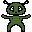
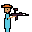
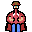
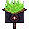

# Shoki's Adventure — Design Iterations & Development Log

This document tracks the evolution of the prototype from the initial concept
to the current state. Each iteration captures **why** the change was made,
not just **what** changed — directly addressing the DDG requirement to
"describe your interesting choices and how you improved them during the iterations."

---

## Iteration 0 — Initial Concept

**Combat style:** Top-down grid tactics, inspired by Into the Breach + Mewgenics.

**Initial design parameters:**

| Element | Value |
|---|---|
| Grid | 30×30 top-down |
| Player movement | 3×3 chunk-based |
| Attacks | Melee (8 adjacent) / Ranged (3-5 tiles) |
| Traps | Spike / Pit / Slow Zone, ~7% density |
| Waves | 10 escalating enemy spawns |
| Upgrades | +25% Melee or Ranged after each wave |
| Win condition | Survive 10 waves |
| Fun type (LeBlanc) | Challenge |

**Narrative:** A human survives an alien invasion by repairing his crashed
spaceship before being captured.

---

## Iteration 1 — Narrative Flip: Player Becomes the Alien

**Problem:** The original "human escapes aliens" framing felt generic, and the
crash site set dressing didn't match a human protagonist visually.

**Change:** Swapped the roles — the player is now **Shoki**, an alien whose
craft crash-landed on Earth. The humans are the antagonists trying to capture
him before he can repair the ship.

**Why it improved the design:**
- Gives Shoki a clearly sympathetic motivation (escape capture, go home).
- The "industrial debris" hazards now logically belong to the human world,
  not the alien's wreckage.
- Three enemy archetypes (Soldier, Sniper, Heavy) naturally map to escalating
  human military response — narrative justifies the difficulty curve.

---

## Iteration 2 — Camera Angle: Top-Down → Isometric

**Problem:** The first prototype used a flat top-down camera. Pixel art looked
flat and undifferentiated; depth cues were missing.

**Change:** Switched to a **2:1 isometric projection**. Tiles are now
diamond-shaped cubes that visually layer with Y-sorting, giving the room a
sense of dimension.

**Implementation details:**
- `GridManager.GridToWorld(x, y)` projects to `((x-y) * tileWidth, (x+y) * tileHeight)`.
- Each tile sprite is 64×32 px (2:1 aspect) at PPU 16, giving a 2 × 1 world unit footprint.
- Entities sort by `(height - gridY) * 10` so front rows render above back rows.

**Why it improved the design:**
- Matches the visual reference language of *Into the Breach* and *Mewgenics*.
- Tile occupancy is more readable — players can see who is "in front of" who.
- Pixel art tiles benefit from the third visible face (the cube side wall).

---

## Iteration 3 — Grid Resize: 30×30 → 8×8

**Problem:** A 30×30 grid plus 3-tile movement made early waves feel hollow.
Enemies and Shoki barely interacted; matches dragged.

**Change:** Shrunk the grid to **8×8**. Player move range reduced to 2. Trap
counts cut from "density-based" to fixed (1 spike + 1 slow zone per room).
Enemy spawns rebalanced for the smaller space (wave 1 = 2 enemies, wave 10 = 5).

**Why it improved the design:**
- Every move now matters — there is no neutral ground.
- Traps occupying 1 / 64 tiles is dangerous but rare, making each one a real
  tactical landmark.
- Faster wave clear → tighter loop → more upgrade decisions per session.

---

## Iteration 4 — Pokémon-Type Counters: Considered, then Dropped

**Hypothesis:** Adding a type system (e.g. Melee > Ranged > Drone > Melee)
would deepen the combat decisions, giving each enemy a "preferred counter."

**Why we dropped it:**
- Adds two layers of memorisation the player must hold (type chart + enemy
  type per unit) before they can plan.
- The melee/ranged split already creates a positional counter system — Snipers
  punish closing in, Heavies punish staying away — without needing labels.
- Scope risk for a 6-week prototype: balancing a type chart requires far more
  playtesting than balancing flat damage values.

**Decision:** Keep the positional counter system; type counters are out of
scope for the prototype but noted as a stretch goal.

---

## Iteration 5 — Enemy Telegraphs (ITB-Style)

**Problem:** Initiative-based turns meant the player could be hit by an enemy
before realising the enemy was even in range. Combat felt punishing rather
than tactical.

**Change:** At the start of each round, every enemy:
1. Computes its planned move + attack tile.
2. Displays a **yellow pulsing tile** on the planned attack target.
3. Displays a **dim grey outline** on the planned move destination.
4. **Commits** to the planned attack tile when its turn arrives — even if Shoki has moved away.

This is straight from *Into the Breach* — the player can dodge attacks by
reading telegraphs and moving out of yellow tiles before the enemy fires.

**Why it improved the design:**
- Turns each round into a small puzzle — "which yellow tile must I leave empty?"
- Rewards positioning over reaction speed.
- Makes initiative-based ordering a *feature* (slow enemies can be neutralised
  by attacking them before they trigger their telegraph).

---

## Iteration 6 — Companion System (Levels 3 / 6 / 9)

**Problem:** Mid-game upgrades (+25% melee or ranged) became samey by wave 5.
The decision space wasn't expanding alongside the difficulty curve.

**Change:** After clearing **waves 3, 6, and 9**, the player picks one of
three companions in addition to the standard damage upgrade. Companions stack
up to 3 alive at once, take their own turn in initiative, and **permadeath
once killed**.

| Companion | HP | Speed | Range | Damage | Niche |
|---|---|---|---|---|---|
| **Drone**     | 20 | +2 | Ranged 2-4 | 6  | Glass cannon, picks off snipers |
| **Brawler**   | 40 |  0 | Melee      | 12 | Tank, soaks hits, controls space |
| **Trickster** | 25 | +3 | Melee or Ranged 1-2 | 5 | Acts **twice** per turn |

**Why it improved the design:**
- Matches the *Into the Breach* squad model (3 mechs) and *Mewgenics* squad
  model (small group of distinct cats).
- Each milestone offers a build-defining choice. The same pool means players
  can double-up (e.g. 2 Drones) for specialised builds.
- Permadeath turns companions into "expendable but valuable" — players must
  decide whether to risk them.

---

## Iteration 7 — Post-Wave Healing

**Problem:** Damage accumulated across waves with no recovery, making runs feel
like a slow death spiral rather than a sequence of tactical puzzles.

**Change:** When a wave is cleared, Shoki heals for **half the damage he took
during that wave**. The amount is shown on the upgrade screen.

**Why it improved the design:**
- Long-term sustainability — players who take 10 HP in wave 1 are not still
  paying for it by wave 8.
- Self-balancing: taking 0 damage = 0 heal, taking heavy damage = bigger heal.
  Skilled play is still rewarded.
- Creates a clear reward feedback loop ("Recovered X HP from your wounds")
  reinforcing wave completion.

---

## Iteration 8 — Colour Palette Rework

**Problem:** Initial colour choices clashed during play:
- Soldiers and Heavies were both red.
- The **attack-target highlight** was also red — clicking on an enemy made
  the whole tile mush together visually.
- The dark navy background didn't read as "alien crash site."

**Changes:**

| Element | Before | After |
|---|---|---|
| Soldier | Bright red | Gunmetal grey |
| Sniper | Yellow | Camo green |
| Heavy | Dark red | Steel navy |
| Brawler | Green | Amber (was conflicting with Sniper) |
| Attack highlight | Red | Bright orange |
| Background | Dark navy | Dark purple |

**Why it improved the design:**
- Every entity and UI element is now visually distinct.
- Red is reserved for *damage feedback* — semantically clean.
- The purple background gives a slight alien/night-time feel that matches the
  narrative.

---

## Iteration 9 — Real Sprites Replace Placeholders

**Change:** Procedurally-generated coloured squares replaced with hand-drawn
32×32 pixel art (Aseprite) for Shoki, Sniper, Heavy, Drone, and the ground tile.

A `PixelArtImporter` Editor script enforces correct import settings (point
filter, no compression, single-sprite mode, bottom-center pivot for entities,
top-face-center pivot for tiles) on anything dropped into `Resources/Tiles/`
or `Resources/Entities/`. New sprites can be added by drag-and-drop with no
code changes.

**Why it improved the design:**
- Production-ready art pipeline — designers can iterate on sprites without
  touching code or Unity import settings.
- Sprites match the *Shovel Knight* / *Into the Breach* visual reference
  (bold outlines, limited palette).
- Placeholder squares remain as fallbacks for unfinished sprites, so the
  game stays runnable through art development.

---

## Sprite Reference (Current Prototype Art)

### Tiles

| Asset | Preview | Notes |
|---|---|---|
| Ground (tan) |  | Default floor tile |
| Ground alt (purple) |  | Variant — not yet wired in |

### Entities

| Asset | Preview | Role |
|---|---|---|
| Shoki |  | Player — alien protagonist |
| Sniper |  | Enemy — ranged 2-4 tiles, retreats from melee |
| Heavy |  | Enemy — slow tank, high damage |
| Drone |  | Companion — ranged glass cannon |

### Still to be drawn

- `soldier.png` — Soldier enemy (grunt, melee)
- `brawler.png` — Brawler companion (tank, melee)
- `trickster.png` — Trickster companion (acts twice per turn)
- `obstacle.png`, `spike.png`, `pit.png`, `slow.png` — Tile variants for hazards

These currently render as coloured square fallbacks during prototyping.

---

## Visual & Design References

The prototype draws stylistic and mechanical inspiration from three games.
Reference screenshots can be placed in `Documentation/references/` (see
folder for placeholder file).

### Into the Breach (Subset Games)
- Grid tactics, telegraphed enemy moves, "dodge by repositioning" mechanic.
- Squad-of-three composition that we mirrored in the companion cap.
- Clear visual hierarchy: ground tiles are muted, danger tiles pop in yellow.

### Mewgenics (Edmund McMillen / The Binding of Isaac Team)
- Permadeath companions with distinct stat profiles.
- Turn-based combat with initiative ordering.
- Roguelite progression — meaningful choice between runs.

### Shovel Knight (Yacht Club Games)
- 2D pixel art style: bold black outlines, limited palette per sprite.
- Expressive character silhouettes at 32×32 resolution.
- Visual reference for the entity sprite proportions and palette.

---

## Architecture Snapshot (Current)

```
Assets/
├── Editor/
│   └── PixelArtImporter.cs     ← auto-imports PNGs with pixel-art settings
├── Resources/
│   ├── Tiles/                   ← ground.png, ground_alt.png
│   └── Entities/                ← shoki.png, sniper.png, heavy.png, drone.png
└── Scripts/
    ├── Core/                    ← GameManager, GridManager, TurnManager, SpriteLoader, PlaceholderSetup
    ├── Combat/                  ← CombatSystem, TrapSystem, TelegraphSystem
    ├── Entities/                ← Entity (base), PlayerController, EnemyAI, CompanionAI
    ├── Generation/              ← RoomGenerator, EnemySpawner
    ├── Upgrades/                ← UpgradeManager
    └── UI/                      ← UIManager (stub), PlaceholderUI (OnGUI)
```

---

## Next Iterations (Planned)

- Replace remaining placeholder squares with hand-drawn sprites
  (soldier, brawler, trickster, hazard tiles).
- Add a brief "wave intro" splash showing the wave number + enemy composition.
- Add sound effects for hits, traps, and companion deaths.
- Author 3-5 iteration playtest sessions and log feedback.
